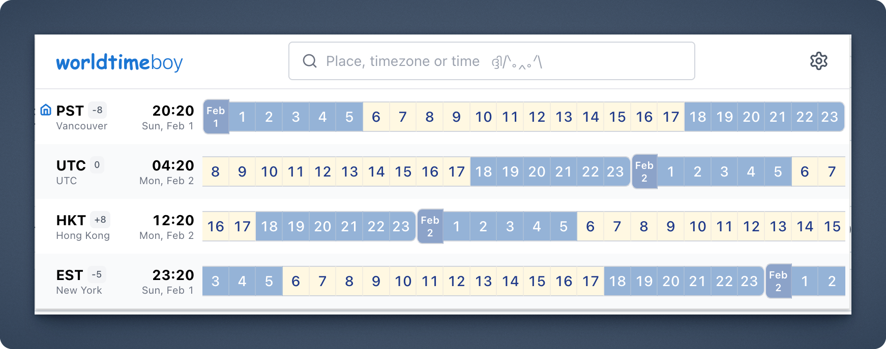
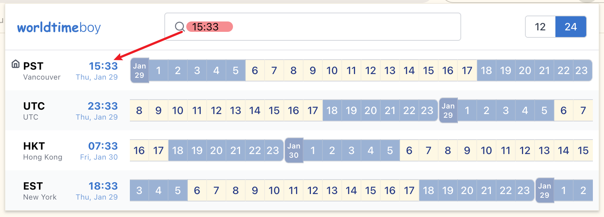
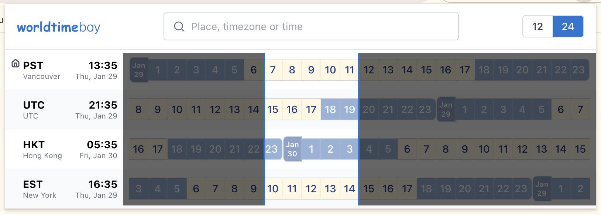

# WorldTimeBoy Chrome Extension

A lightweight Chrome Extension that displays multiple timezones in [WorldTimeBuddy.com](https://www.worldtimebuddy.com/) styled interface.

## Features

- Multi-timezone time display with 12/24-hour time scale
- Search and add timezones
- Time range selection with drag-to-select
- Real-time time updates

## Screenshots




## Installation & Development

### Option 1: Install from Chrome Web Store

Visit the [Chrome Web Store link](https://chromewebstore.google.com/detail/gmbobjlafdlebknmneehhkhalhkncdja?utm_source=item-share-cb) and add the extension directly to your browser.

### Option 2: Build & Install Locally

1. Install dependencies:
   ```bash
   npm install
   ```

2. For development, start the dev server:
   ```bash
   npm run dev
   ```

3. To build for production:
   ```bash
   npm run build
   ```

4. Load the extension in Chrome:
   - Run the production build: `npm run build`
   - Open Chrome and go to `chrome://extensions/`
   - Enable "Developer mode"
   - Click "Load unpacked"
   - Select the `dist` directory


## Project Structure

```
worldtimeboy/
├── src/
│   ├── components/     # React components
│   ├── data/           # Custom city-timezone data
│   ├── hooks/          # Custom React hooks
│   ├── utils/          # Utility functions
│   ├── types/          # TypeScript type definitions
│   └── popup/          # Popup entry point
├── public/             # Static assets (manifest.json, icons)
└── dist/               # Build output (generated)
└── screenshots/        # Screenshots
```

## Technologies

- React 18
- TypeScript
- Vite
- date-fns-tz
- Chrome Extension Manifest V3

## Version

1.1.0

## Credits

- Developed with AI assistance using Cursor
- Inspired by [WorldTimeBuddy](https://www.worldtimebuddy.com/)
- Extension icon from [Flaticon](https://www.flaticon.com/)
- UI icons (SVG) from [Lucide](https://lucide.dev/)